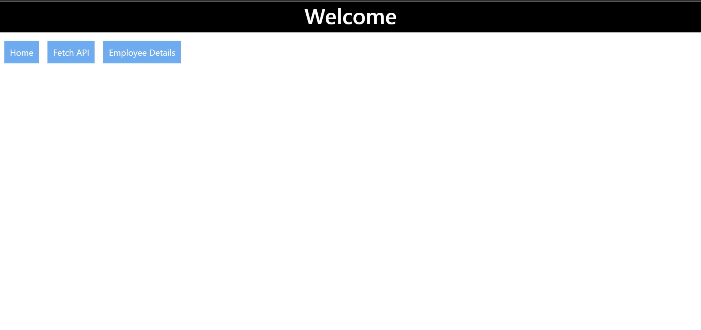
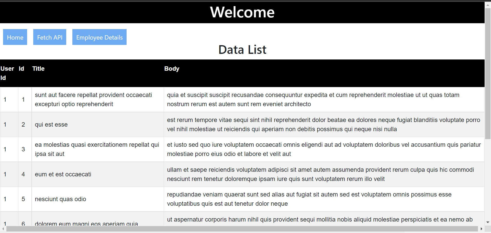
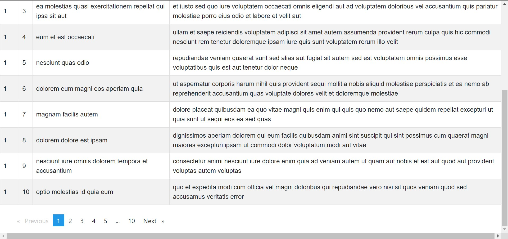
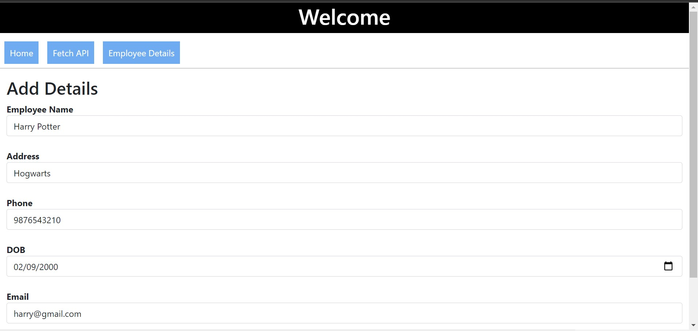
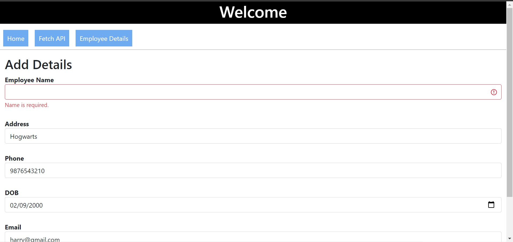
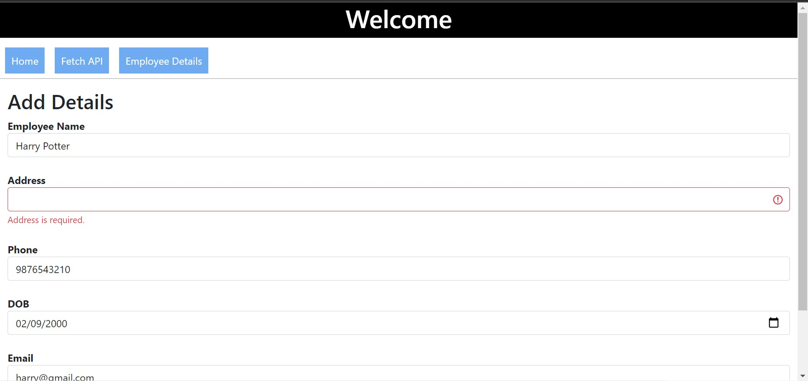
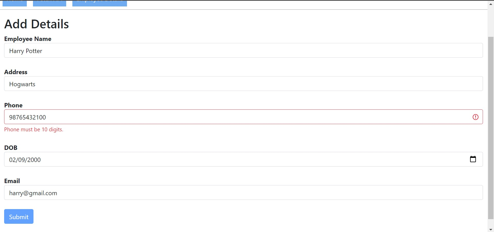
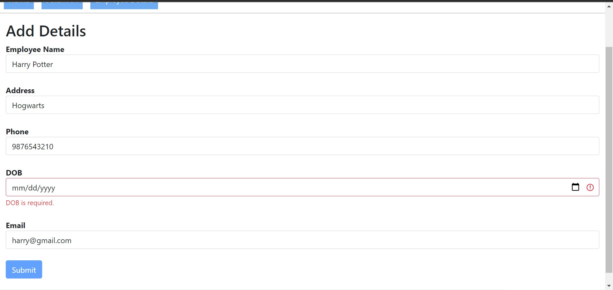
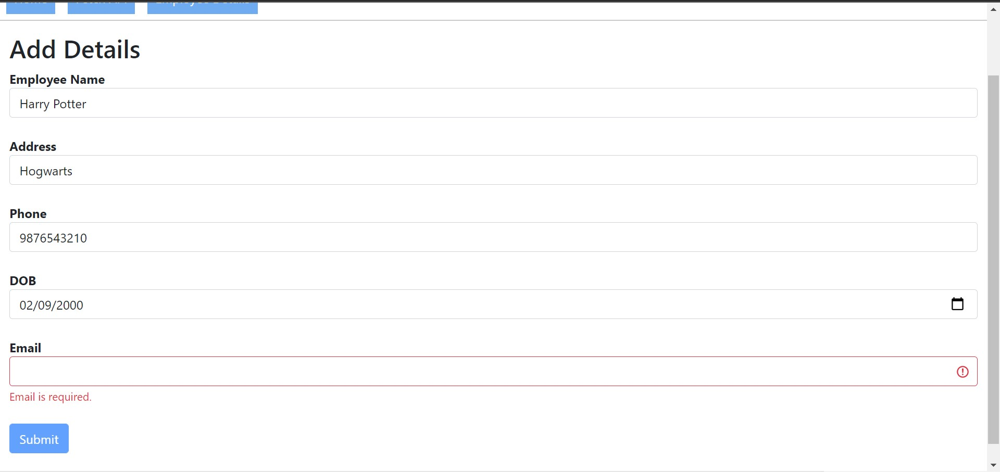
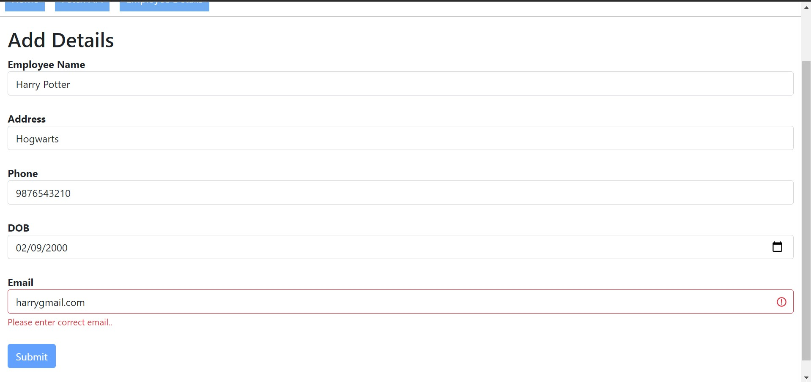

# Angular

**Angular** is the assignment submitted under training course Angular in **Quantiphi** developed using `Angular` framework.

### Downloading the Code

* Go to (<https://github.com/kgayush/Angular>) and click on **Fork**
* You will be redirected to *your* fork, `https://github.com/<your_user_name>/Angular`
* Open the terminal, change to the directory where you want to clone the **Angular** repository
* Clone your repository using `git clone https://github.com/<your_user_name>/Angular`
* Enter the cloned directory using `cd Angular/`

### Software requirements

* Download NodeJS `https://nodejs.org/en/download/`
* Open the terminal, Install Angular `npm install -g @angular/cli`
* Git

### Running server

* Run the server `ng serve` 

### Screenshots

* Home 

 
 
* Fetch API

 
 
* Pagination  
 
 
 
* Employee Details 
 
 
 
* Name Validation
 
 
 
* Address Validation 
 
 
 
* Phone Validation 
 
 
 
* Phone Validation 
 
 
 
* DOB Validation
 
 
 
* Email Validation 
 
 
 
* Email Validation 
 
 
 
* Output 
 
 
